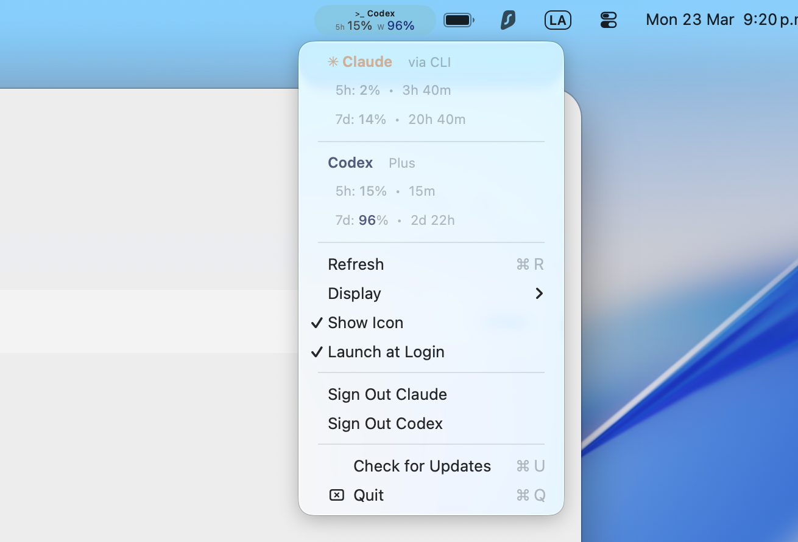

# Just A Usage Bar

<p align="center">
  
</p>

A lightweight macOS menu bar app that shows your **Claude** and **Codex** (OpenAI) usage at a glance -- 5-hour rolling window and 7-day limits, right in your menu bar.

<p align="center">
  
</p>


## Install

```bash
brew install betoxf/tap/justausagebar
```

That's it. If you have Claude CLI or Codex CLI logged in, the app auto-detects your credentials -- zero config.

> **No Homebrew?** Run this instead:
> ```bash
> /bin/bash -c "$(curl -fsSL https://raw.githubusercontent.com/betoxf/JustaUsageBar/main/install.sh)"
> ```

---

## Quick Start

1. **Install** -- `brew install betoxf/tap/justausagebar`
2. **Launch** -- open JustaUsageBar from Applications (or `open -a JustaUsageBar`)
3. **Done** -- if you use Claude CLI or Codex CLI, credentials are detected automatically

If you don't use the CLIs, click the menu bar item > **Setup Usage Tracking** > **Sign in with Browser**.

---

## Features

- Shows 5-hour and 7-day usage percentages for **Claude** and **Codex**
- Auto-detects Claude CLI and Codex CLI credentials (OAuth) -- zero setup
- Smooth dissolve animation alternating between providers in the menu bar
- Configurable switch interval (5s / 8s / 10s / 15s / 30s)
- Display modes: Both percentages, 5h only, or Weekly only
- Toggle providers: show Claude, Codex, or both
- Auto-refreshes OAuth tokens when expired
- Falls back to browser session login for Claude if CLI not available
- Launch at Login support
- Minimal resource usage (~0% CPU when idle)

## Menu Bar

| Provider | Label | Style |
|----------|-------|-------|
| Claude | `✳︎ Claude` | Anthropic orange accents |
| Codex | `> Codex` | Terminal icon, subtle blue accents |

When both providers are active, the menu bar alternates between them with a smooth dissolve animation. Left-click to switch manually, or use "Switch Every > Manual" for click-only mode.

**Click the menu bar item** to see:

| Option | What it does |
|--------|-------------|
| Usage details | Current % and time until reset for each provider |
| Refresh (Cmd+R) | Manually refresh usage data |
| Display > Show Both / 5h Only / Weekly Only | Change what numbers are shown |
| Display > Show Claude / Show Codex | Toggle which providers appear |
| Display > Switch Every | Animation interval (Manual / 5s / 8s / 10s / 15s / 30s) |
| Show Icon | Toggle the provider label above the numbers |
| Launch at Login | Start automatically on macOS login |
| Sign Out | Sign out of Claude or Codex independently |

## Setup Details

### Automatic (Recommended)

The app auto-detects credentials on launch:

**Claude CLI** -- reads `~/.claude/.credentials.json`
```bash
# If you haven't already:
npm install -g @anthropic-ai/claude-code
claude login
```

**Codex CLI** -- reads `~/.codex/auth.json`
```bash
# If you haven't already:
npm install -g @openai/codex
codex login
```

### Manual (Claude only)

1. Click menu bar > **Setup Usage Tracking** > **Sign in with Browser**
2. Log in to claude.ai normally -- credentials are extracted automatically
3. If auto-extraction fails, use **Manual Entry** with session key + org ID from DevTools

## Common Commands

| Action | Command |
|--------|---------|
| Install | `brew install betoxf/tap/justausagebar` |
| Update | `brew upgrade betoxf/tap/justausagebar` |
| Uninstall | `brew uninstall justausagebar` |
| Check version | `brew info betoxf/tap/justausagebar` |
| Check auto-start | Menu bar > look for checkmark on "Launch at Login" |
| Launch manually | `open -a JustaUsageBar` |

## How It Works

### Authentication Priority

| Priority | Method | Source | Auto-refresh |
|----------|--------|--------|-------------|
| 1 | Claude OAuth | `~/.claude/.credentials.json` or Keychain | Yes |
| 2 | Claude Web Session | Browser cookie extraction | No |
| 3 | Codex OAuth | `~/.codex/auth.json` | Yes |

### API Endpoints

| Provider | Endpoint |
|----------|----------|
| Claude (OAuth) | `GET api.anthropic.com/api/oauth/usage` |
| Claude (Web) | `GET claude.ai/api/organizations/{orgId}/usage` |
| Codex | `GET chatgpt.com/backend-api/wham/usage` |

Usage refreshes every 60 seconds. OAuth tokens refresh automatically when expired.

## Troubleshooting

| Problem | Fix |
|---------|-----|
| "Session expired" (Claude) | Install Claude CLI + `claude login`, or Sign Out > re-authenticate via browser |
| Codex not showing | Run `codex login`, verify `~/.codex/auth.json` exists |
| Usage shows 0% | Click Refresh (Cmd+R) or wait for next auto-refresh |
| Not starting at login | Toggle "Launch at Login" in menu, or check System Settings > Login Items |

## Build from Source

```bash
git clone https://github.com/betoxf/JustaUsageBar.git
cd JustaUsageBar
make release
# App at build/Release/JustaUsageBar.app -- drag to /Applications
```

## Privacy & Security

- All credentials stored locally (AES-256-GCM encrypted, machine-locked)
- OAuth credentials read directly from CLI config files (not copied)
- No telemetry, no analytics, no third-party services
- Not affiliated with Anthropic or OpenAI
- Open source (MIT)

## License

MIT

## Acknowledgments

- **[CodexBar](https://github.com/steipete/CodexBar)** -- Authentication flow and browser session extraction inspired by this excellent Codex usage bar
- **Anthropic** -- Claude API and Claude Code CLI
- **OpenAI** -- Codex API and usage tracking
