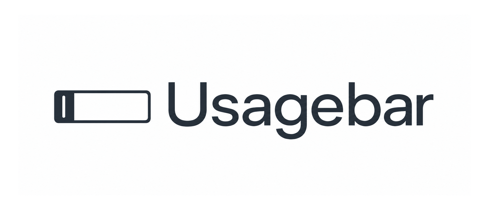

<div align="center">
  

  <p><strong>Claude, Codex, KimiCode, and XAI usage limits, directly in your macOS menu bar.</strong></p>
  <p>A private, native utility for checking rolling and weekly limits without breaking focus.</p>

  <p>
    <a href="https://github.com/betoxf/Usagebar/actions/workflows/ci.yml"></a>
    <a href="https://github.com/betoxf/Usagebar/releases/latest"></a>
    
    
    <a href="LICENSE"></a>
  </p>

  <p>
    <a href="#installation">Install</a> ·
    <a href="#how-it-works">How it works</a> ·
    <a href="docs/ARCHITECTURE.md">Architecture</a> ·
    <a href="CONTRIBUTING.md">Contributing</a> ·
    <a href="SECURITY.md">Security</a>
  </p>
</div>

<p align="center">
  
</p>

## Why Usagebar

Usage limits matter most while you are working. Usagebar keeps the current five-hour window and weekly allowance visible in the menu bar, then gets out of the way.

| Capability | What it gives you |
| --- | --- |
| Multiple providers | Track Claude, Codex, KimiCode, Cursor, z.ai, and XAI (Grok Build) from one status item. |
| At-a-glance limits | See rolling-window and weekly percentages without opening a browser. |
| Native controls | Refresh, change display mode, switch provider cadence, and launch at login. |
| Local credential discovery | Reuse supported Claude CLI and Codex CLI sessions already present on the Mac. |
| Privacy-first operation | No Usagebar account, telemetry, analytics, or intermediary backend. |
| Lightweight runtime | A native Swift menu-bar app with no web runtime or bundled service. |

## Installation

### Homebrew (recommended)

```bash
brew install --cask betoxf/tap/usagebar
```

Upgrade later with `brew update && brew upgrade --cask usagebar`.

### Download a release

Download `Usagebar.zip` from the [latest release](https://github.com/betoxf/Usagebar/releases/latest). Quit any running Usagebar, replace `/Applications/Usagebar.app`, and launch the replacement. Do not keep or launch another copy from Downloads.

> [!NOTE]
> Current release artifacts are not notarized. The Homebrew cask clears the quarantine attribute during installation. If you prefer not to do that, build from source.

### Requirements

- macOS 14 Sonoma or newer
- A supported provider account
- For zero-setup discovery, an authenticated Claude, Codex, or Kimi Code CLI session

## Quick start

1. Install and launch Usagebar.
2. If you already use the provider CLIs, Usagebar discovers their local credentials automatically.
3. Click the menu-bar item to refresh, choose display modes, or configure provider switching.

If a provider is not detected, authenticate its CLI and ask Usagebar to rediscover credentials:

```bash
claude login
codex login
kimi login
```

Claude also supports an in-app browser-session fallback from **Setup Usage Tracking**.

### If Claude shows "Session expired" or authentication fails

Re-authenticate from the terminal — this is the reliable fix:

1. Open Terminal and run `claude` (or `claude login`).
2. Complete the login it prompts for.
3. Click **Refresh** in Usagebar. Usage appears within a few seconds.

Usagebar reads the credentials Claude Code writes locally and never rotates
them itself, so a fresh terminal login is always picked up automatically.

Cursor is discovered from the Cursor.app login (no extra setup). z.ai appears
when a `Z_AI_API_KEY` is configured (environment variable or
`~/.zai/config.json` with `{"apiKey": "..."}`).

KimiCode is discovered from `~/.kimi-code/credentials/kimi-code.json` after
`kimi login`. Usagebar uses the same Kimi Code usage source as CodexBar and
shows the weekly quota plus the rolling five-hour window. A Kimi Code API key
or `kimi-auth` web token can also be saved from **Set Up KimiCode…**.

### Fewer menu-bar icons

Since Usagebar already shows your providers' usage, their own menu-bar icons
are redundant. The reliable way to remove them is each app's own setting:
ChatGPT and Claude both offer a "show in menu bar" toggle in their
preferences. (Usagebar deliberately does not try to hide other apps' icons
itself: modern macOS — especially on notched MacBooks — no longer allows the
lightweight divider trick that utilities like Dozer used, and doing it
properly requires the private-API machinery of a dedicated tool like
Bartender or Ice.)

## Menu-bar controls

| Control | Behavior |
| --- | --- |
| Refresh (`⌘R`) | Fetch the latest available limits immediately. |
| Display mode | Show both windows, the five-hour window only, or the weekly window only. |
| Provider visibility | Choose which detected providers appear and rotate. |
| Switch cadence | Rotate providers automatically or switch manually with a left click. |
| Launch at Login | Register or remove Usagebar as a macOS login item. |
| Sign out | Reset the selected provider's Usagebar state; provider CLI sessions remain provider-owned. |

## How it works

Usagebar is a local status-bar client. It discovers credentials already stored by provider tools, requests usage directly from the provider, normalizes the response, and renders it with AppKit.

```text
Claude CLI / Keychain ───┐
Codex CLI auth.json ─────┼─> local credential discovery ─> provider API ─> menu-bar status
Kimi Code credentials ───┘
```

The app refreshes in the background every two minutes by default. OAuth access tokens are refreshed when supported by the provider session. See [Architecture](docs/ARCHITECTURE.md) for component boundaries, credential priority, and network destinations.

## Privacy and security

- Usage data travels directly between your Mac and the selected provider.
- Usagebar does not operate a backend and does not collect telemetry or analytics.
- CLI credential files are read locally and are never copied to a Usagebar service.
- Claude browser-session credentials saved by the app are encrypted locally with AES-256-GCM using a device-derived key.
- Provider APIs and authentication formats can change independently of Usagebar.

Report suspected vulnerabilities privately according to the [security policy](SECURITY.md). Never include tokens, cookies, session keys, or unredacted credential files in an issue.

## Build from source

You need Xcode 15 or newer with the macOS 14 SDK.

```bash
git clone https://github.com/betoxf/Usagebar.git
cd Usagebar
./script/build_and_run.sh --verify
```

Create a distributable archive with `make release`. The clean archive is written to `build/Usagebar.zip`.

## Repository map

```text
JustaUsageBar/       macOS application source and asset catalog
  Models/            provider-neutral usage models
  Services/          credential discovery and provider API clients
  ViewModels/        refresh orchestration and persisted preferences
  Views/             status item, menus, setup, and settings UI
assets/brand/        approved logo and standalone icon masters
Casks/               Homebrew cask definitions
docs/                architecture, brand, and release documentation
script/              local build and run entrypoint
.github/              CI, issue forms, and pull request guidance
```

## Project documentation

| Document | Purpose |
| --- | --- |
| [Architecture](docs/ARCHITECTURE.md) | Runtime components, data flow, credentials, and network boundaries. |
| [Brand assets](docs/BRAND.md) | Approved identity files and usage guidance. |
| [Contributing](CONTRIBUTING.md) | Local setup, change standards, and validation expectations. |
| [Releasing](docs/RELEASING.md) | Versioning, artifact, tag, and Homebrew update checklist. |
| [Security](SECURITY.md) | Supported versions and private reporting process. |
| [Code of Conduct](CODE_OF_CONDUCT.md) | Community participation expectations. |

## Contributing

Issues and focused pull requests are welcome. Start with [CONTRIBUTING.md](CONTRIBUTING.md), use the repository issue forms, and keep provider credentials out of logs and screenshots.

## Acknowledgements

- [CodexBar](https://github.com/steipete/CodexBar) for authentication-flow inspiration
- Anthropic for Claude and Claude Code
- OpenAI for Codex
- Moonshot AI for Kimi and Kimi Code

Usagebar is an independent open-source project and is not affiliated with, endorsed by, or sponsored by these providers.

## License

Usagebar is available under the [MIT License](LICENSE).
