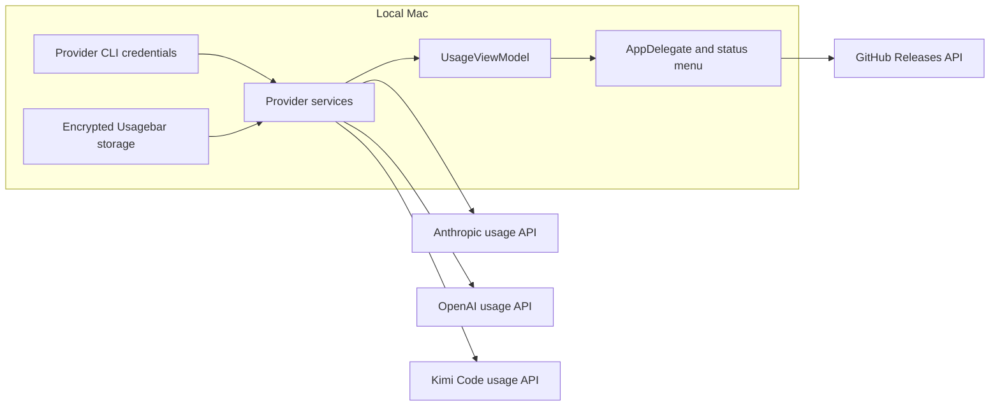

# Usagebar architecture

Usagebar is a native macOS status-bar application with no project-operated backend and no embedded web runtime for its normal usage flow.

## Component responsibilities

| Component | Responsibility |
| --- | --- |
| `JustaUsageBarApp` | SwiftUI entry point and settings scene. |
| `AppDelegate` | Creates the `NSStatusItem`, menus, provider images, switching, and release checks. |
| `UsageViewModel` | Usage state, display preferences, credential availability, refresh orchestration, and launch at login. |
| `ClaudeAPIService` | Selects Claude authentication mode and normalizes responses. |
| `ClaudeOAuthService` | Discovers Claude CLI credentials, refreshes OAuth tokens, and fetches usage. |
| `CodexAPIService` | Discovers Codex credentials, resolves the base URL, refreshes OAuth, and normalizes usage. |
| `KimiAPIService` | Discovers Kimi Code CLI credentials, selects API or web-token authentication, and normalizes weekly plus five-hour usage. |
| `ZaiAPIService` | Discovers a z.ai API key from the environment, Keychain, or local config files and normalizes quota windows. |
| `XaiAPIService` | Discovers Grok Build credentials from `~/.grok/auth.json`, refreshes OIDC tokens, and normalizes weekly Grok Build credits. |
| `CredentialStorage` | Encrypts Usagebar-managed Claude browser-session data and optional Kimi credentials locally. |

## Runtime data flow

1. `UsageViewModel` discovers available credentials during initialization.
2. With at least one provider, it starts an immediate refresh and a two-minute timer.
3. Available providers refresh concurrently.
4. Services validate responses and normalize payloads.
5. The view model publishes state and posts `UsageDataChanged`.
6. `AppDelegate` redraws the status item and rebuilds the menu.

UI state is main-actor isolated. Network requests use `URLSession` and do not pass through a Usagebar service.

## Credential discovery

Claude priority is: Usagebar's encrypted OAuth mirror, `~/.claude/.credentials.json`, the `Claude Code-credentials` Keychain item through `/usr/bin/security`, direct Keychain lookup, then the Usagebar-managed browser session fallback.

Codex reads `${CODEX_HOME}/auth.json` or `~/.codex/auth.json`. It reads `chatgpt_base_url` from `${CODEX_HOME}/config.toml` when present and otherwise uses `https://chatgpt.com`.

Kimi priority mirrors CodexBar: a saved or `KIMI_CODE_API_KEY` API key, a Kimi Code CLI OAuth credential from `${KIMI_CODE_HOME}/credentials/kimi-code.json` (default `~/.kimi-code/credentials/kimi-code.json`), then a saved or `KIMI_AUTH_TOKEN` `kimi-auth` web token. Usagebar refreshes an expiring CLI access token through Kimi Code's OAuth endpoint and atomically writes the rotated token bundle back to the same CLI-owned file with mode `0600`. The refresh coordinates with Kimi Code's `oauth/kimi-code.lock` convention so concurrent CLI and menu-bar refreshes do not overwrite one another.

## Network boundaries

| Purpose | Default destination |
| --- | --- |
| Claude OAuth usage | `https://api.anthropic.com/api/oauth/usage` |
| Claude OAuth refresh | `https://platform.claude.com/v1/oauth/token` |
| Claude browser-session usage | `https://claude.ai/api/organizations/{orgId}/usage` |
| Codex usage | `https://chatgpt.com/backend-api/wham/usage` |
| Codex OAuth refresh | `https://auth.openai.com/oauth/token` |
| Kimi Code usage | `https://api.kimi.com/coding/v1/usages` |
| Kimi Code OAuth refresh | `https://auth.kimi.com/api/oauth/token` |
| Kimi web-token usage fallback | `https://www.kimi.com/apiv2/kimi.gateway.billing.v1.BillingService/GetUsages` |
| Update discovery | `https://api.github.com/repos/betoxf/Usagebar/releases/latest` |
| z.ai quota | `https://api.z.ai/api/monitor/usage/quota/limit` |
| XAI / Grok Build billing | `https://cli-chat-proxy.grok.com/v1/billing?format=credits` |
| XAI OIDC refresh | `https://auth.x.ai/oauth2/token` |

A configured Codex base URL changes the Codex usage destination. Provider-private endpoints or payloads can change independently.

## Local persistence

| Data | Storage |
| --- | --- |
| Display preferences | `UserDefaults` through `@AppStorage` |
| Launch at login | `SMAppService.mainApp` |
| Claude browser-session data, OAuth mirror, and optional Kimi credential | `~/Library/Application Support/JustaUsageBar/credentials.enc` |
| Provider CLI credentials | Provider-owned files or Keychain items; Kimi OAuth tokens may be refreshed in place, while other provider credentials are read only |

Usagebar-managed credential data uses AES-256-GCM with a key derived from the Mac hardware UUID and an application salt.

Homebrew updates use a quit-first handoff. Usagebar checks release and cask state while running, starts its bundled update helper, and terminates before Homebrew replaces the app. The cask quits any remaining old process and opens the installed replacement. The bundle also prohibits multiple instances, so a second copy cannot create another status item.

The primary interface is AppKit for precise status-item drawing; SwiftUI is used for settings and authentication. The app runs as `LSUIElement`, so it has no normal Dock icon while running, but the application icon remains visible in Finder and installation surfaces.

Provider changes must keep discovery inside services, raw payload parsing provider-specific, published state in `UsageViewModel`, and menu rendering based on normalized models. New storage or network destinations require documentation and security review.
