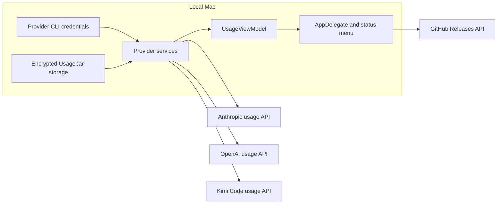

# Usagebar architecture

Usagebar is a native macOS status-bar application with no project-operated backend and no embedded web runtime for its normal usage flow.

```mermaid
flowchart LR
    subgraph Local["Local Mac"]
        CLI["Provider CLI credentials"]
        Store["Encrypted Usagebar storage"]
        Services["Provider services"]
        VM["UsageViewModel"]
        UI["AppDelegate and status menu"]
        CLI --> Services
        Store --> Services
        Services --> VM
        VM --> UI
    end
    Services --> Claude["Anthropic usage API"]
    Services --> Codex["OpenAI usage API"]
    Services --> Kimi["Kimi Code usage API"]
    UI --> Releases["GitHub Releases API"]
```

## Component responsibilities

| Component | Responsibility |
| --- | --- |
| `JustaUsageBarApp` | SwiftUI entry point and settings scene. |
| `AppDelegate` | Creates the `NSStatusItem`, menus, provider images, switching, focus following, and release checks. |
| `UsageViewModel` | UI state, cached credential availability, per-provider refresh scheduling, power-state handling, and launch at login. |
| `ProviderActor` | Serializes provider and credential storage work away from the UI actor. |
| `UsageRefreshPolicy` | Provider selection, refresh cadence, retry deadlines, and Retry-After parsing. |
| `ProviderHTTP` | Sends every provider and release request on a short-lived session and closes it when the last request finishes. |
| `TerminalAgentDetector` | Reads terminal sessions from the process table to tell which AI CLI is in use. |
| `ClaudeAPIService` | Selects Claude authentication mode and normalizes responses. |
| `ClaudeOAuthService` | Discovers Claude CLI credentials, refreshes OAuth tokens, and fetches usage. |
| `CodexAPIService` | Discovers Codex credentials, resolves the base URL, refreshes OAuth, and normalizes usage. |
| `KimiAPIService` | Discovers Kimi Code CLI credentials, selects API or web-token authentication, and normalizes weekly plus five-hour usage. |
| `ZaiAPIService` | Discovers a z.ai API key from the environment, Keychain, or local config files and normalizes quota windows. |
| `KeychainTool` | Reads a Keychain secret through `/usr/bin/security` without holding up other work when that tool has to ask. |
| `XaiAPIService` | Discovers Grok Build credentials from `~/.grok/auth.json`, refreshes OIDC tokens, and normalizes weekly Grok Build credits. |
| `CredentialStorage` | Encrypts Usagebar-managed Claude browser-session data and optional Kimi credentials locally. |

## Runtime data flow

1. `UsageViewModel` discovers provider availability asynchronously on `ProviderActor` and publishes an in-memory snapshot for UI decisions. It repeats discovery on every manual refresh, and otherwise no more often than hidden readings refresh.
2. Enabled providers refresh concurrently on launch. If every display switch is off, only the displayed authenticated fallback refreshes.
3. One owned refresh task and one one-shot timer schedule the next due work. The normal interval is two minutes; Low Power Mode raises it to at least five minutes. Timers have 10% tolerance. That interval applies to readings on screen: the displayed provider, every enabled provider while they rotate, and all of them while the menu is open. Other enabled providers refresh five times less often, and immediately once they are shown.
4. Each provider tracks its last attempt, last successful update, and retry deadline. Failures back off from the normal interval up to 30 minutes. HTTP `Retry-After` deadlines are honored even for manual refreshes. A success clears the failure delay.
5. Display or system sleep cancels pending requests and stops timers. Cancellation preserves credentials and previous readings. Wake refreshes only stale providers. Low Power Mode also pauses optional provider rotation.
6. A provider re-enabled in Display refreshes immediately unless a server cooldown is still active. Manual Refresh bypasses local delay and rediscovers credentials.
7. `AppDelegate` uses normalized usage and the credential snapshot to select a provider. It keeps at most one rendered image per provider, keyed by displayed values, appearance, backing scale, update badge, and display settings. Identical images are not reassigned.
8. The menu is built when it opens, so reset countdowns and per-provider Last Updates labels are current without a UI timer. An open menu updates when usage or settings change.

UI state and drawing remain main-actor isolated. Provider services and encrypted credential storage share `ProviderActor`, a separate serial executor. Network awaits permit requests to overlap while keeping credential mutation serialized. No provider service is called by a drawing or provider-availability getter.

Requests use one ephemeral `URLSession` with no cookie storage or response cache. Requests that overlap share it, and the last one to finish invalidates it, so no HTTP/2 or HTTP/3 connection stays open between refreshes. A kept-alive connection wakes the process for keepalives and network-path updates; a new handshake per refresh costs less.

Claude and Cursor cache absent credentials briefly; Kimi caches credential discovery for 30 seconds but always rereads during usage fetches and inside its OAuth refresh lock. Explicit Refresh clears discovery caches. An unchanged Claude OAuth mirror is not rewritten, and the existing device-derived encryption key is reused in memory.

The browser login view owns a cancellable repeating timer. Dismantling the view stops polling, cancels scheduled extraction, stops navigation, and ignores late callbacks.

## Focus following

With Follow Active App on, the frontmost application selects the provider: Claude, ChatGPT or Codex, Cursor, KimiCode, ZCode (z.ai), and Grok map by bundle identifier or name. Any other application, including a terminal whose CLI has ended, leaves the last provider on screen and lets rotation resume; a manual click overrides it until the next AI app or CLI comes to the front.

An application that is not mapped is checked for terminal sessions. `TerminalAgentDetector` lists pseudo-terminals by last input time, which is how `w` measures idle time, and reads the foreground processes of the most recently used session that the application hosts. A session with another application bundle among its ancestors belongs to that application; sessions under a detached server such as tmux or iTermServer count for any application that hosts a terminal. The launch path and arguments identify Claude Code, Codex, Cursor Agent, Kimi, and Grok. For Claude Code, `ANTHROPIC_BASE_URL` in the process environment selects z.ai or Kimi when it points at their gateway, and no provider when it points at another one.

The check runs when an application comes to the front and repeats off the main thread while that application hosts terminals: every three seconds at first, every six once the application has been in front for about fifteen seconds, and every ten in Low Power Mode. It stops while the display sleeps and when fewer than two providers can be shown. It needs no Accessibility, Automation, or Screen Recording access, and nothing it reads is stored or sent.

## Credential discovery

Claude priority is: Usagebar's encrypted OAuth mirror, `~/.claude/.credentials.json`, the `Claude Code-credentials` Keychain item through `/usr/bin/security`, direct Keychain lookup, then the Usagebar-managed browser session fallback.

Codex reads `${CODEX_HOME}/auth.json` or `~/.codex/auth.json`. It reads `chatgpt_base_url` from `${CODEX_HOME}/config.toml` when present and otherwise uses `https://chatgpt.com`.

Kimi priority mirrors CodexBar: a saved or `KIMI_CODE_API_KEY` API key, a Kimi Code CLI OAuth credential from `${KIMI_CODE_HOME}/credentials/kimi-code.json` (default `~/.kimi-code/credentials/kimi-code.json`), then a saved or `KIMI_AUTH_TOKEN` `kimi-auth` web token. Usagebar refreshes an expiring CLI access token through Kimi Code's OAuth endpoint and atomically writes the rotated token bundle back to the same CLI-owned file with mode `0600`. The refresh coordinates with Kimi Code's `oauth/kimi-code.lock` convention so concurrent CLI and menu-bar refreshes do not overwrite one another.

z.ai reads `Z_AI_API_KEY`, `ZAI_API_KEY`, or `ZHIPU_API_KEY` from the environment, then a Keychain item named `user.z-ai-api-key`, `openclaw.zai-api-key`, `Z_AI_API_KEY`, or `ZAI_API_KEY`, then `~/.zai/config.json`, `~/.config/zai/config.json`, or `~/.config/codexbar/config.json`. Usagebar finds the Keychain item from its attributes, which never raise a dialog, and reads the secret through `/usr/bin/security`, never in process. That tool created the item, so it reads it without asking, and a permission granted to it survives app updates; one granted to Usagebar's ad hoc signed binary is lost with every build. If the tool does have to ask, Usagebar waits at most 1.5 seconds, leaves the dialog for the user, and carries on with the other providers. An answer is picked up by the next lookup, and after a refusal only **Refresh** asks again. A key that was found is kept until **Refresh** or until z.ai rejects it.

## Network boundaries

| Purpose | Default destination |
| --- | --- |
| Claude OAuth usage | `https://api.anthropic.com/api/oauth/usage` |
| Claude OAuth refresh | `https://platform.claude.com/v1/oauth/token` |
| Claude browser-session usage | `https://claude.ai/api/organizations/{orgId}/usage` |
| Codex usage | `https://chatgpt.com/backend-api/wham/usage` |
| Codex OAuth refresh | `https://auth.openai.com/oauth/token` |
| Kimi Code usage | `https://api.kimi.com/coding/v1/usages` |
| Kimi Code OAuth refresh | `https://auth.kimi.com/api/oauth/token` |
| Kimi web-token usage fallback | `https://www.kimi.com/apiv2/kimi.gateway.billing.v1.BillingService/GetUsages` |
| Update discovery | `https://api.github.com/repos/betoxf/Usagebar/releases/latest` |
| z.ai quota | `https://api.z.ai/api/monitor/usage/quota/limit` |
| XAI / Grok Build billing | `https://cli-chat-proxy.grok.com/v1/billing?format=credits` |
| XAI OIDC refresh | `https://auth.x.ai/oauth2/token` |

A configured Codex base URL changes the Codex usage destination. Provider-private endpoints or payloads can change independently.

## Local persistence

| Data | Storage |
| --- | --- |
| Display preferences | `UserDefaults` through `@AppStorage` |
| Launch at login | `SMAppService.mainApp` |
| Claude browser-session data, OAuth mirror, and optional Kimi credential | `~/Library/Application Support/JustaUsageBar/credentials.enc` |
| Provider CLI credentials | Provider-owned files or Keychain items; Kimi OAuth tokens may be refreshed in place, while other provider credentials are read only |

Usagebar-managed credential data uses AES-256-GCM with a key derived from the Mac hardware UUID and an application salt.

Homebrew updates use a quit-first handoff. Usagebar checks release and cask state while running, starts its bundled update helper, and terminates before Homebrew replaces the app. The cask quits any remaining old process and opens the installed replacement. The bundle also prohibits multiple instances, so a second copy cannot create another status item.

The primary interface is AppKit for precise status-item drawing; SwiftUI is used for settings and authentication. The app runs as `LSUIElement`, so it has no normal Dock icon while running, but the application icon remains visible in Finder and installation surfaces.

Provider changes must keep discovery inside services, raw payload parsing provider-specific, published state in `UsageViewModel`, and menu rendering based on normalized models. New storage or network destinations require documentation and security review.
